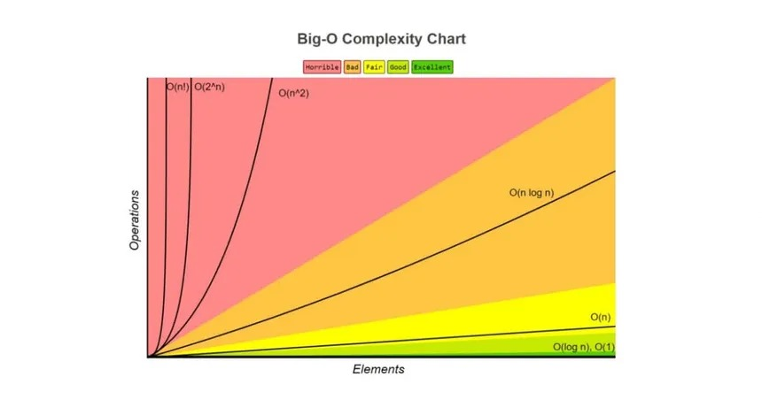

# Teoria de la Complejidad 
Nombres:
* Stephan Cedillo
* Alfonso Auquilla
* Andres Zuñiga
* Christopher Carrangui
* Oliver Valdiviezo 

## ¿Que és?
La teoria de la complejidad esta basada en ideas y modelos  fundamentales nacidas del cálculo y de la técnicas de la ingeniería de estructura de datos

Esta teoria estudia los recursos que se requieren para  resolver problemas como el tiempo y el espacio que requiera el mismo

## Eficiencia de algoritmos

### Coste temporal

La eficiencia de los algoritmos y su coste temporal es una medida de cuánto tiempo tarda un programa en ejecutarse

### Coste espacial
Representa la cantidad de memoria que necesita  una algoritmo para completar la ejecución,se expresa en notación Big O, una complejidad espacial de O(1), lo que indica un uso constante del espacio.

## Factores de tiempo de ejecución

### Factores propios

Los factores propios son puramente la logica del codigo y el codigo en si mismo, siendo constante que no importa en que maquina se ejecute.
Datos curiosos: 
terria de np=p

### Factores circunstanciales
Es el factor en funcion al tiempo de cuando un numero de operaciones es ejecutdada midiendo en segundos,milisegundos o nanosegundos.El programa mide que tan rapido va el programa, donde un O(n^2) va ir peor que un O(n).

### Análisis teórico
El análisis teorico es el medio por el cual un programador puede predecir y entender el comportamiento del sistema que se va realizar sin necesidad de escribir ni una sola linea de codigo. Basándose en el rigor matemático donde definimos conceptos claro, dejamos de lado la intuición y basar cada paso que demos en teorías anteriormente planeadas
### Análisis experimental
Es el proceso por el cual se manipulan variables independientes bajo ciertas condiciones. Es el medio que permite medir el funcionamiento de un programa en computadoras de distintas capacidades (desde máquinas antiguas hasta las más actuales), para que el programador pueda determinar si el algoritmo planteado requiere ajustes antes de llegar a su versión final.

## Notación de Complejidad

### ¿Qué es la notación Big O?
Es la representacion de un algoritmo de acuerdo al tiempo de ejecucion y uso de memoria del programa , para poder completar un algoritmo planteado .Implicando el desempeño del programa en los peores caos, facilitando a un algortimo el crecimiento en funcion de la entrada del algoritmo.

### Tipos de notaciones

1. Mejor caso:

   Representa el Límite inferior.El algoritmo no será más rápido que esto.
El número que buscas es el primero de la lista. Solo haces una operación.
Terminaste en un instante
2. Peor caso
3. Caso promedio
4. Big O, Omega (Ω), Theta (Θ)

Puedes ver la los ejemplos [Ejemplos Java](./EjemploComplejidad/Ejemplos.md).

## Conclusiones

### ¿Qué complejidad es más costosa y por qué?
### ¿Qué aprendieron del análisis?
### ¿Qué les sorprendió más al ver el código?
### ¿Lo que ustedes crean conveniente?
